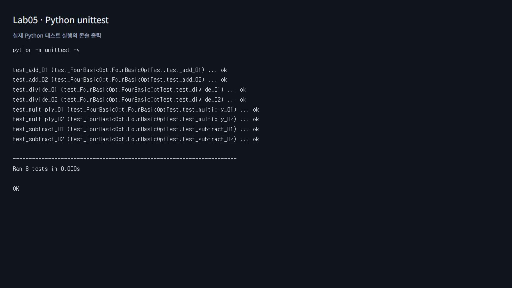
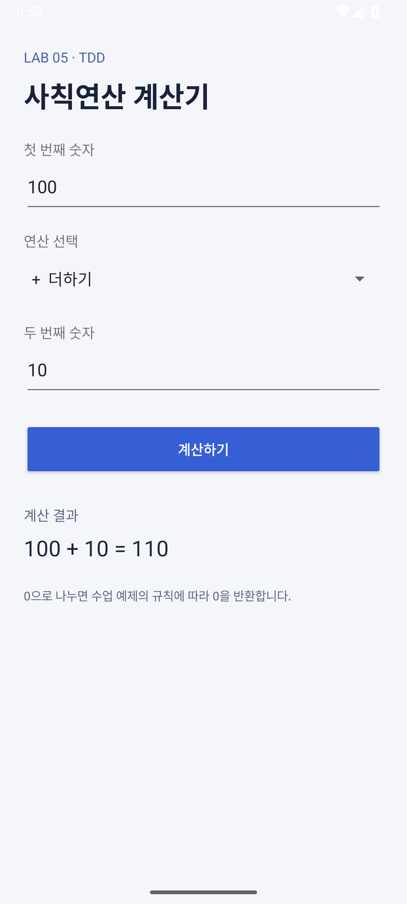

# Lab05 — 사칙연산 TDD와 Android 앱

모바일 웹 서비스 프로젝트 실습 5 제출용 저장소입니다.

## 프로젝트 구성

- `python-tdd/`: Python 사칙연산 클래스와 unittest 테스트 8개
- `android-calculator/`: Java/XML Android 앱 전체 소스와 Gradle Wrapper
- `screenshots/`: 실행 결과 이미지
- `test-results/`: 실제 Python 실행 로그, Android JUnit XML, 앱 화면 검증 결과
- `artifacts/lab05-calculator.apk`: 에뮬레이터에서 실행을 확인한 디버그 APK

## Python 실행

Python 3의 표준 라이브러리만 사용합니다. 추가 패키지 설치는 필요 없습니다.

```powershell
cd python-tdd
python -m unittest -v
```

결과: **8개 테스트 모두 통과**.

실습 과정에서 먼저 테스트와 빈 계산 메서드를 작성하여 8개 실패를 확인했습니다.
덧셈 구현 후 2개 통과, 뺄셈 구현 후 4개 통과, 나머지 연산 구현 후 8개 모두 통과했습니다.

## Android 실행

1. Android Studio에서 `android-calculator` 폴더를 엽니다.
2. Gradle 동기화를 완료합니다. Gradle 8.11.1, Android Gradle Plugin 8.9.2를 사용합니다.
3. Android SDK Platform 35와 Build Tools 35.0.0이 필요합니다.
4. 에뮬레이터 또는 Android 6.0(API 23) 이상의 기기를 선택하고 앱을 실행합니다.
5. 숫자 두 개와 연산을 선택한 후 **계산하기**를 누릅니다.

Windows에서는 프로젝트와 Gradle 캐시를 **영문 경로**에 두는 것을 권장합니다.
이 환경에서는 한글 경로의 Gradle 테스트 클래스 로딩 문제가 발생하여 동일한 소스를 영문 경로에 복사한 뒤 빌드·테스트했습니다.
`local.properties`는 각 PC의 SDK 경로가 들어가는 로컬 설정이라 Git에서 제외했습니다. Android Studio에서 해당 PC의 SDK를 설정하세요.

### 계산 엔진 테스트

Android 프로젝트 폴더에서 실행합니다. Gradle 실행에는 JDK 17 이상이 필요합니다.
Android Studio에 포함된 JDK를 사용해도 됩니다.

```powershell
.\gradlew.bat testDebugUnitTest assembleDebug
```

- `Calculator.java`: Android UI에 의존하지 않는 계산 엔진
- `CalculatorTest.java`: 로컬 JVM에서 실행하는 JUnit 테스트 **10개**
- `MainActivity.java`: 입력값 검증, 엔진 호출, 결과 표시
- `activity_main.xml`: 숫자 입력칸 2개, 연산 선택, 버튼, 결과 표시

결과: **10개 테스트 통과, APK 빌드 성공**.
실제 API 36 에뮬레이터에서 덧셈·뺄셈·곱셈·나눗셈, 0 나눗셈, 빈 입력 안내를 확인했습니다.

## 0 나눗셈 처리

수업 PDF 51페이지의 테스트는 `divide(100, 0)`에서 `0`을 기대합니다.
52페이지의 단순 `x / y` 구현과는 불일치하므로, 본 실습은 테스트 요구사항에 맞춰 나누는 수가 0이면 0을 반환하도록 구현했습니다.
Python과 Android 엔진에서 같은 규칙을 사용합니다.

## 실행 이미지

### Python 최종 콘솔 출력

아래 이미지는 실제 `python -m unittest -v` 실행에서 얻은 콘솔 텍스트를 브라우저 로그 화면에 표시하여 캡처한 것입니다.
터미널 창 자체의 캡처는 아닙니다. 원본 출력은 `test-results/python-unittest.txt`에 포함했습니다.



### Android 앱 실행

실제 Android 에뮬레이터에서 `100 + 10 = 110`을 실행한 화면입니다.



## 제출

저장소 URL: https://github.com/sylee21c/lab05

두 프로젝트의 전체 소스, 계산 엔진 테스트, 실행 이미지가 포함되어 있습니다.
